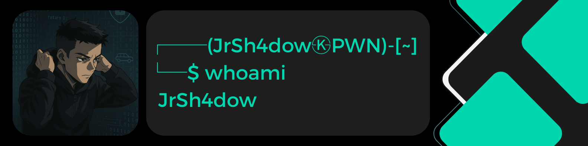

  

<h1 align="center">💫 About Me:</h1>
I’m a Computer Engineering student at the Polytechnic University of Valencia.   
I’m currently learning <b>Cybersecurity (Pentesting)</b> and aiming to earn my <b>eCCPT</b> certification, with plans to pursue <b>OSCP</b> in the future.

<h1 align="center">💻 Tech Stack:</h1>

  
  
  
  
  
  
  
  

<h1 align="center">📊 GitHub Stats:</h1>

  
  

  

<h3 align="center">🔝 Top Contributed Repo</h3>

  

